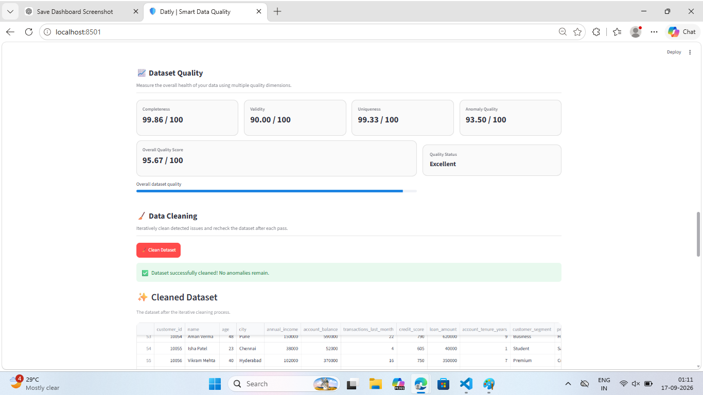

Datly
Data Quality & Anomaly Detection Platform
Datly is a Python-based data quality platform that helps analyze, validate, detect anomalies, clean, and evaluate CSV datasets through an interactive Streamlit interface.

Overview
Data quality problems such as missing values, duplicates, invalid values, inconsistent data, and outliers can affect analysis and decision-making.

Datly provides a single workflow to inspect a dataset, identify quality issues, detect anomalies, apply cleaning operations, and measure the resulting data quality.

## Dashboard Preview

Features
📂 CSV dataset upload
🔍 Dataset profiling
📊 Data quality analysis
⚠️ Anomaly and outlier detection
🧹 Automated data cleaning
🔁 Iterative cleaning workflow
📈 Quality score calculation
💡 Data quality recommendations
📄 Professional TXT and HTML quality reports
🖥️ Interactive Streamlit dashboard
👀 Dataset preview and analysis
How Datly Works
Upload CSV
    ↓
Dataset Profiling
    ↓
Quality Checks
    ↓
Anomaly Detection
    ↓
Quality Score
    ↓
Cleaning & Validation
    ↓
Recommendations
    ↓
Quality Report
Tech Stack
Python
Pandas
Streamlit
HTML / CSS
Git & GitHub
Project Structure
Datly/
│
├── app.py
├── main.py
├── requirements.txt
├── .gitignore
│
├── data/
│   ├── clean_dataset.csv
│   ├── duplicate.csv
│   ├── finance.csv
│   ├── invalid_values.csv
│   ├── missing_values.csv
│   ├── mixed_data.csv
│   ├── outliers.csv
│   └── ...
│
└── src/
    ├── anomaly_detection.py
    ├── data_cleaning.py
    ├── data_profiler.py
    ├── profiling.py
    ├── quality_checks.py
    ├── quality_report.py
    ├── quality_rules.py
    ├── quality_score.py
    └── recommendations.py
Getting Started
1. Clone the repository
git clone https://github.com/satyam2004a/Datly.git
cd Datly
2. Create a virtual environment
python -m venv venv
3. Activate the virtual environment
Windows:

venv\Scripts\activate
4. Install dependencies
pip install -r requirements.txt
5. Run Datly
streamlit run app.py
The application will open in your browser.

Example Workflow
A typical Datly analysis follows this process:

Upload a CSV dataset.
Preview the dataset.
Profile columns and dataset characteristics.
Run data quality checks.
Detect anomalies and outliers.
Calculate the dataset quality score.
Apply cleaning operations where required.
Re-check the dataset.
Review recommendations.
Generate a quality report.
Purpose
Datly was developed as a hands-on software project to explore practical applications of:

Data analysis
Data quality engineering
Anomaly detection
Python and Pandas
Streamlit application development
Modular software architecture
Automated data cleaning
Reporting and visualization
Future Scope
Potential future improvements include:

Support for larger datasets
Additional anomaly detection techniques
More advanced statistical profiling
Database connectivity
Automated data quality monitoring
Scheduled dataset validation
API integration
Deployment as a hosted application
Author
Satyam Raj

BTech Computer Science

⭐ If you find Datly interesting, feel free to explore the project and its implementation.